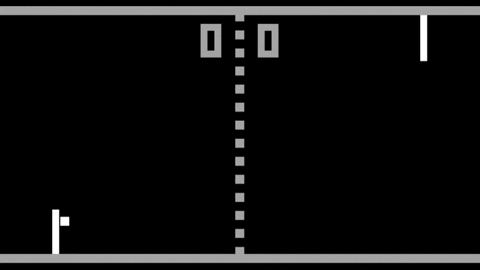

# Basic Pong game

### As a beginner learning C and game development, creating a clone of the classic Pong game is a great way to start. Using the Raylib library, which is designed for simple and fast game programming, it's possible to build a fully working Pong game with just basic knowledge of programming.

### In this project, two players control paddles on opposite sides of the screen using keyboard input. A ball moves across the screen, bouncing off the top and bottom edges. If it hits a paddle, it bounces back, and the speed increases slightly to make the game more challenging. If the ball passes beyond a paddle, the opposing player scores a point and the ball resets to the center.

### Raylib makes it easy to handle graphics, input, and collision detection. You can draw rectangles for the paddles, a circle for the ball, and use functions like CheckCollisionCircleRec() or manual distance calculations for collision detection.

### This project helps beginners understand:

- 2D game loops and logic

- Keyboard input handling

- Collision detection

- Using structs like Vector2 and Rectangle

- Drawing on screen with Raylib functions

# Technologies used 🛠️ 

<table>
  <tr>
    <td></td>
    <td>
      <strong>Raylib</strong> is a simple and easy-to-use library to learn game programming. It is written in C and great for building 2D/3D games, especially for beginners.
    </td>
  </tr>
  <tr>
    <td></td>
    <td>
       <strong>C</strong> is a powerful and efficient programming language. It is widely used for system-level development, embedded systems, and game engines.Learning C helps build a solid foundation in logic, memory management, and performance-focused code.
    </td>
  </tr>
  <tr>
    <td></td>
    <td>
      <strong>ChatGPT</strong> was used as a learning assistant throughout this project.
      It helped with understanding C syntax, getting code suggestions, fixing bugs, and learning how to use the Raylib library.
      A great tool for beginners to ask questions, test ideas, and improve their coding logic in real time.
    </td>
  </tr>

</table>
